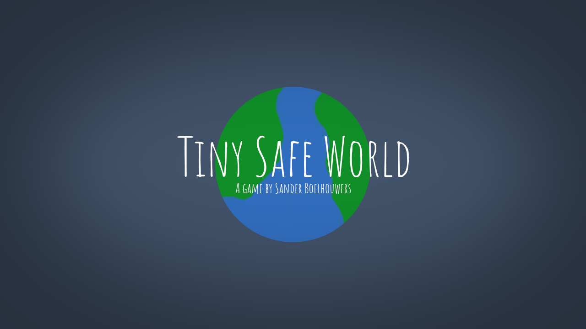

# Tiny Safe World

Tiny Safe World is a game made by me for Ludum Dare 38 (in circa 20 hours).

The game is programmed using c++ and the SFML library.

## Controls
The game controls are very simple:
* A & D - move the player left or right.
* Left & Right - shoot left or right.
* W - if you didn't place a house, place a house at your location.

## What could I do better
There are a lot of things in this game that can be better, but the most important things that can be better:
 * Entity Handling
 * Collision Handling
 * Refactor everything a bit more
 * Motivate myself a bit more
 * Use some sort of attractor for the planet